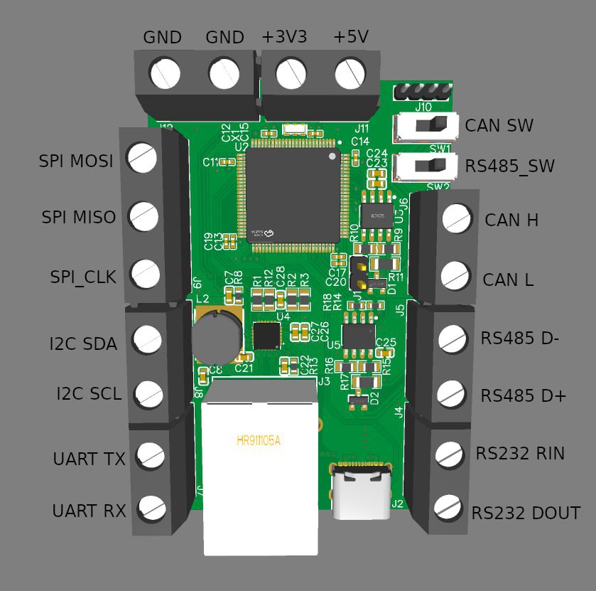

# Translator
Provides a commucation bridge between different interfaces

### Board
[Translator PCB](https://oshwlab.com/optim0/translator)  

### Supported interfaces
- USART
- RS232
- RS485
- CAN
- ETH
- SPI
- I2C
